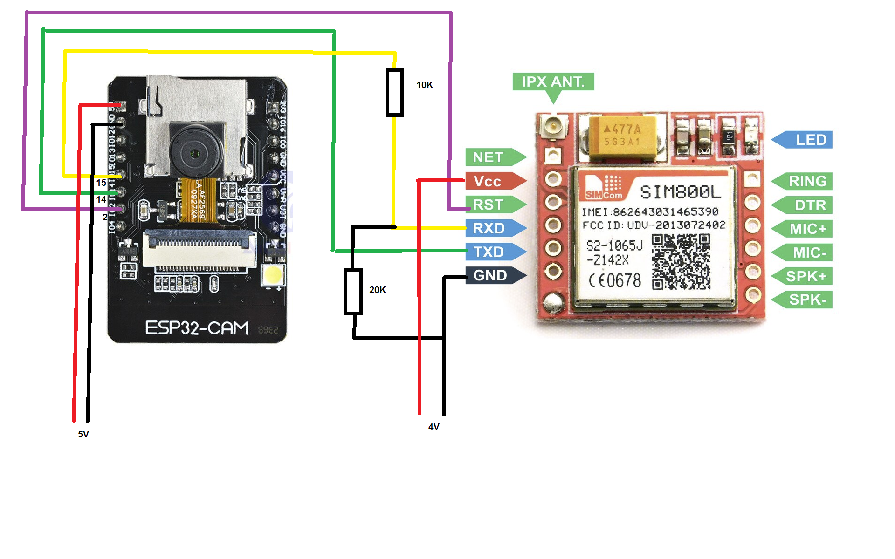

I roll back to https://github.com/pawel-piwowar/esp32cam/commit/d091dd2df8f462de2a622e40bd5025812037246c because the latest version is not working for me
i got:
Guru Meditation Error: Core 1 panic'ed (LoadProhibited). Exception was unhandled.

and i change the hardware, i used sim800l v2.2 board 

i try many v2.2 board, but not working at all (i got AT+CREG 0,2 and 0,3 errors all the time)

except this:
https://www.aliexpress.com/item/1005003683528292.html

if you buy this board you need to double check:

the resistors and capacitors are soldered on the sim card slot side,
the capacitor on the IC side is bigger


wiring:
i use my pc usb port to power up the esp32 board
and a laboratory power supply  (I set 3A; V set 5V) for power up sim800l module


###########################################################################################################
# Esp32 Cam Sim800L GSM module integration
Sample code for sending pictures from Esp32 Cam to FTP Server using SIM 800L GSM module.   
In this example pictures are taken in predefined periods (e.g. every 10 minutes, every hour, etc.).
After being taken, picture is sent directly to FTP server.

This project was created for low power consumption scenario (powering from batteries or accumulators).  
After sending the picture to FTP server, Esp32 Cam sends deep sleep command to SIM 800L and activates sleep mode for itself.
This allows achieving very low power consumption,
since most of the time both modules consume very low amount of power in their sleep modes.

FTP connection parameters are read from file : "ftpParams.h"
Such file needs to be created and placed in the same directory as main program.
Example content of ftpParams.h:

```
const String ftpServerAddress = "ftp.myserver";  
const int ftpServerPort = 21;  
const String ftpUser = "myUserName";  
const String ftpPassword = "myPass1234";  
```


## Hardware setup:



### Wiring

Esp32 Cam communicates with SIM800L using serial connection.  (Pins 14 and 15)
Code fragment responsible for initiating serial connection:
```
Serial2.begin(115200,SERIAL_8N1,14,15);
```
Since SIM800L data pins voltage should not exceed 2.8V, resistors are used for TX line to lower the voltage level.
(line which is used to send data from cam to gsm module).

PIN 2 of ESP32 Cam is used for sending RESET signal to SIM800L RST pin. 
This feature is used if GSM module is not responding to AT commands 
(which happens sometime, for example after transmission errors). 

### Power supply
ESP32 Cam and SIM800L are powered separately.
SIM800L can consume 2A in peaks and if power source cannot deliver such current, it will not connect to the network.
Also make sure that the wires powering SIM800L are thick enough and not too long
(for example wires which are usually used for golden pin connections are to slim ).
I used two separate step-down regulated DC/DC converters which allows delivering exact voltage to each module.
Powering SIM800L directly from 3,7 V acu is also possible, however when the voltage drops to aprox. 3,6 V
SIM800L can have problems connecting to GSM network. 
Solution to this problem could be adding 1000 microF capacitor connected to VCC and GND of SIM800L.
Anyway, it seems to be better idea to power SIM800L from higher voltage source (e.g two 3,7 acu in serial connection) 
lowering the output voltage to 3.8 - 4.2 V with step-down DC regulator.       
